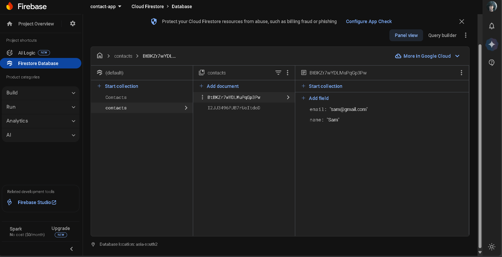

# 📒 Firebase Contact App

A simple **Contact Management App** built with **React + Firebase**.  
This app lets you **Add, Read, Update, and Delete (CRUD)** contacts and stores them securely in **Google Firebase Realtime Database**.

🚀 **Live Demo**: [Firebase Contact App](https://chipper-cannoli-3c151a.netlify.app/)

---

## ✨ Features

- Add a new contact (Name + Gmail).
- View all contacts stored in Firebase.
- Update existing contacts.
- Delete contacts.
- Search contacts easily.
- Real-time sync with Firebase Database.

---

## 🛠️ Tech Stack

- **Frontend**: React.js
- **Database**: Firebase Realtime Database
- **Deployment**: Netlify

---

## 📸 Screenshots

### 🖥️ App UI


### 🔥 Firebase Database

Contacts are stored in **Firebase Realtime Database** in this format:

```json
{
  "contacts": {
    "-Nabc123xyz": {
      "name": "Sam",
      "email": "sam@gmail.com"
    },
    "-Ndef456uvw": {
      "name": "Mike",
      "email": "mike@gmail.com"
    }
  }
}
```

## 

⚡ How It Works

1. Enter a Name and Email in the input box.

2. Click ➕ to add contact.

3. Use the 🔄 (edit) icon to update contact.

4. Use the 🗑️ (trash) icon to delete contact.

5. All changes are instantly saved in Firebase.

---

📚 What I Learned

1. CRUD operations with Firebase.

2. How Firebase stores and syncs data in real-time.

3. Connecting React frontend with Firebase backend.

4. Deploying React app on Netlify.
