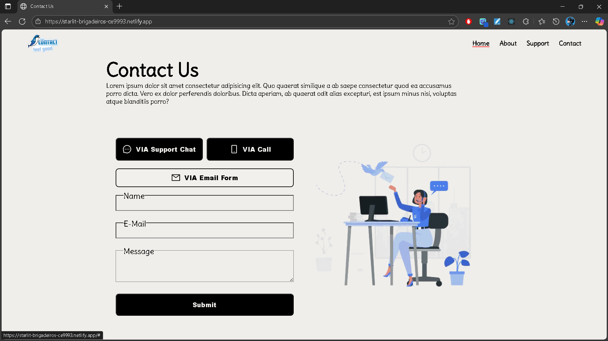

# Contact Us Page 📞

A responsive **Contact Us form** built with **React.js**, focusing on component reusability and modular styling.  
This project demonstrates how to break down a UI into smaller parts and manage them with props and CSS modules.

---

## 🔗 Live Demo

[View Project Here](https://starlit-brigadeiros-ce9993.netlify.app/)

---

## 🖼️ Preview

---

## ⚡ Features

- Clean and responsive UI
- Separate **components** for Header, Navbar, Form, and Buttons
- Reusable **Button component** with `variant` prop for different styles
- Organized structure with **CSS Modules** (`Component.module.css`)
- Static form layout (no backend integration yet)

---

## 🛠️ Tech Stack

- React.js
- CSS Modules
- Vite

---

## 📚 What I Learned

- How to break a page into smaller reusable React components
- Passing props for customization (like `variant` for buttons)
- Managing styles using **CSS modules** for better scoping
- Building a responsive layout

---
