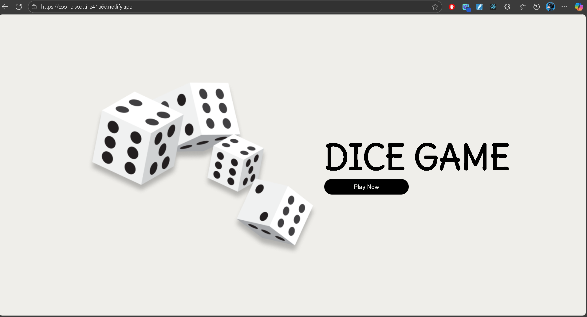

# Dice Game 🎲

A simple and fun **React.js game** where you select a number and roll the dice.  
If your guess matches the dice roll, you gain points. Otherwise, you lose points.

This project helped me practice using **styled-components** to keep JavaScript and CSS in the same file.

---

## 🔗 Live Demo

[Play Dice Game Here](https://cool-biscotti-e41a6d.netlify.app/)

---

## 🖼️ Preview

---

## ⚡ Features

- Interactive dice rolling
- Score tracking system
- Number selection validation
- Styled entirely with **styled-components** (no external CSS files)
- Reset & Show Rules options

---

## 🛠️ Tech Stack

- React.js
- Vite
- Styled-Components

---

## 📚 What I Learned

- How to use **styled-components** for styling React components
- Writing and managing styles in the **same file** as the component
- Handling simple game logic with React state
- Building a fun UI without relying on CSS files

---
