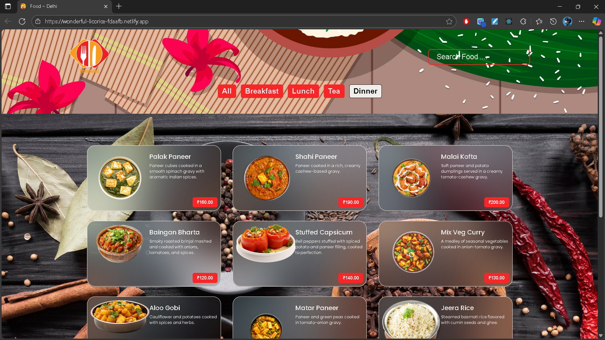

# 🍴 Food Ordering Website

A modern and responsive **Food Ordering Website** built with **React.js**.  
This project was a great learning experience where I practiced fetching data from a backend, showing it on the UI, and applying filters using **React hooks** like `useEffect`.

🔗 **Live Preview:** [Food Website on Netlify](https://wonderful-licorice-fdaafb.netlify.app/)

---

## 🚀 What this project does

- Shows a list of food items with **images, descriptions, and prices**
- Lets users **filter** items by category (All, Breakfast, Lunch, Tea, Dinner)
- Includes a **search bar** to quickly find food
- Uses **React useEffect** to load and display data
- Clean, simple, and responsive design

---

## 🛠️ Tech Stack

- **React.js** – Components & UI
- **JavaScript (ES6+)** – App logic
- **CSS3** – Styling
- **Backend (API)** – Food data source

---

## 📸 Screenshot

---
