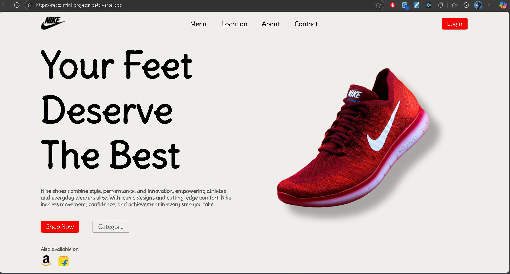

# Nike Landing Page 👟

A clean and modern **static landing page** inspired by Nike, built with **React.js**.  
This project is mainly focused on practicing layout, components, and styling.

---

## 🔗 Live Demo

[View Project Here](https://react-mini-projects-beta.vercel.app/)

---

## 🖼️ Preview



---

## ⚡ Features

- Static single-page design
- Clean and modern UI
- Responsive layout
- Simple navigation bar (non-functional)

---

## 🛠️ Tech Stack

- React.js
- CSS
- Vite

---

## 📚 What I Learned

- Structuring a React project
- Building reusable UI components
- Styling and layout with CSS/Tailwind
- Basics of responsive design

---

## 🚀 Installation

1. Clone this repository

   ```bash
   git clone https://github.com/SumantKrSingh/react-mini-projects.git
   ```

2. Navigate to the project folder

```bash
cd react-mini-projects/nike-homepage
```

3. Install dependencies

```bash
npm install

```

4. Start the development server

```bash
npm run dev

```
